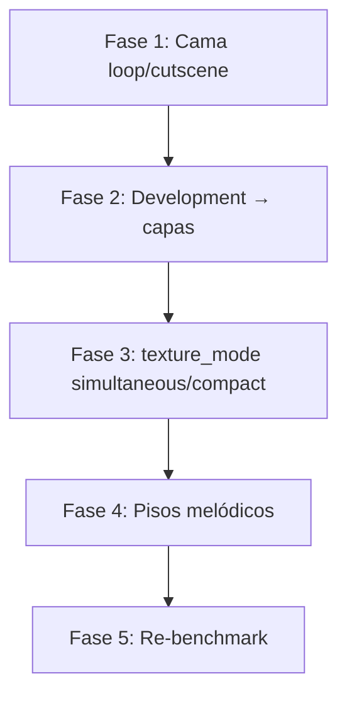

# Plan de mejora Cadence — benchmark suite (mayo 2026)

Documento de referencia tras las 5 generaciones alineadas con `examples/benchmark_prompts.json` y el corpus MIDI en `examples/`.

## Objetivo

Acercar cada salida `cadence_<arquetipo>_*.rsong` a los **rangos métricos** del arquetipo correspondiente, corrigiendo causas estructurales (no parches por género): textura sostenida, solapamiento de capas, desarrollo audible y densidad melódica.

## Resultados benchmark actuales

| Arquetipo | Archivo | Ajuste | Problema principal |
|-----------|---------|--------|-------------------|
| sparse_loop | `cadence_sparse_loop_193944` | 50% | 1–2 capas activas; melodía sola con huecos; 0 cambios acorde/bar |
| moderate_cinematic | `cadence_moderate_cinematic_194334` | **67%** | Melodía rala (4.1 vs 6–7.6 n/bar); silencios ~30% |
| dense_dance | `cadence_dense_dance_194642` | **83%** | Melodía poco densa vs Spider/Bad Apple (3.8 vs 7–16) |
| energetic_game | `cadence_energetic_game_195023` | 17% | Stack gordo (4.8 capas, 7 pistas) vs Kraid (~3) |
| boss_orchestral | `cadence_boss_orchestral_195458` | 33% | Pocas capas simultáneas (4.8 vs 7–9); riqueza 10 vs ASGORE |

**Promedio ajuste:** ~50% — meta intermedia **≥70%** en los 5; meta stretch **≥80%** en dense_dance y moderate_cinematic.

---

## Diagnóstico integrado

### A. Silencio “ruidoso” en loop y cutscene (observación tuya)

**Síntoma:** A veces solo suena un instrumento (casi siempre melodía) de forma intermitente; el resto del tiempo queda vacío perceptible.

**Causas en el pipeline:**

1. **`layer_schedule` + `filter_events_by_schedule`** recortan opcionales y a veces dejan solo melodía (y bajo/drums apagados en loop/cutscene).
2. **Loop/cutscene:** `percussion_suppressed`, bajo/melodía condicionados por `narrative_apply` (`melody_should_play`, `bass_should_play`).
3. **Pad** con `chord_sustain` existe en arreglo pero entra tarde o no cubre compases sin melodía.
4. **Melodía** con muchos `rest` en el patrón LLM; no hay regla de “cama sonora mínima” cuando el lead calla.

**No es solo “bajar silencios en melodía”:** hace falta **textura continua** (pad + bajo pulso suave o drone) independiente del lead.

### B. Orquestal: muchos instrumentos, pocos sonando a la vez (observación tuya)

**Síntoma:** El plan lista muchas capas, pero el benchmark mide **capas activas simultáneas** bajas (no coincide con ASGORE).

**Causas:**

1. **`LAYER_STAGGER` / `CLIMAX_STAGGER`** en `layer_schedule.py` — entradas escalonadas por compás dentro de la sección.
2. **`active_sections`** por sección en `arrangement.py` — capas que no están en todas las secciones.
3. El benchmark cuenta **notas superpuestas por compás**, no “instrumentos en el plan”.

**Conclusión:** Para `boss_orchestral` hace falta un modo **solapamiento alto** (varias capas desde el compás 0 de la sección, sin stagger largo), no más IDs en el plan.

### C. Subdivisions de development no audibles (observación tuya)

**Síntoma:** El plan de desarrollo tiene micro-arcos, pero la orquestación y el arreglo no cambian por segmento.

**Estado actual:**

- `DevelopmentSegment` afecta solo **grados/contorno melódico** en `melody_phrases.phrases_to_events`.
- `layer_schedule` se construye por **sección narrativa**, no por segmento de `development_theory`.
- `instrument_planner` no recibe el mapa de segmentos.

**Oportunidad:** Cada segmento puede fijar **qué capas entran/salen** y con qué transform (introduce → pad; climax → arp+counter+stab). Esto ataca orquestal y energetic a la vez.

### D. Hallazgos benchmark previos (sin duplicar trabajo)

| Tema | Acción ya iniciada | Pendiente |
|------|-------------------|-----------|
| Lead stack compacto (energetic_game) | `apply_lead_support_cap` en arrangement | Validar en nueva generación; techo duro en planner |
| Eco desde arp en stack denso | `resolve_echo_source_for_stack` | — |
| Densidad melódica game | `melody_post` densify/fill | Subir piso por `use_case` + rol narrativo |
| Subdivisions motivicas | `development_theory` + hints LLM | **Vincular a capas** (este plan, fase 2) |

---

## Principios del plan (generalidad)

1. Señales por **`use_case`**, **`narrative_role`**, **densidad**, **longitud de sección** y **arquetipo inferido** — no listas de género.
2. Dos modos de textura: **`bedded`** (cama continua, loop/cutscene) vs **`stacked`** (muchas capas superpuestas, boss orquestal).
3. **Development** gobierna melodía **y** ventanas de orquestación en secciones largas.
4. Criterio de éxito = **`midi_benchmark --suite`**, no escucha subjetiva sola.

---

## Fase 1 — Cama sonora mínima (loop + cutscene)

**Meta benchmark:** `sparse_loop` ≥65%, `moderate_cinematic` ≥75%; bajar `melody_rest_ratio` percibido y subir `layers_active_mean` sin subir a battle.

### 1.1 Política `minimum_bed` por use_case

Nuevo módulo o funciones en `repertoire_signals.py` / `layer_schedule.py`:

- **`use_case in (loop, cutscene)`:** capas núcleo de cama = `pad` + `bass` (pulso bajo o `chord_sustain`), melodía opcional con `min_density` alto.
- Regla: si melodía tiene eventos en &lt;50% de los compases de una sección, **pad debe cubrir 100%** de esos compases (notas largas o acordes por bar).
- Loop: `melody` puede estar ausente en secciones `reflection`; el bed no se apaga.

### 1.2 Arreglo y schedule

- `build_layer_schedule`: para loop/cutscene, **stagger = 0** en pad/bass; entrada en compás global de inicio de sección.
- `arrangement.py`: en cutscene, no usar `HIGH_ENERGY_SECTIONS` para perc/arp salvo densidad &gt; 0.8.
- `compose` pad: priorizar `chord_sustain` / acorde por bar en secciones con densidad &lt; 0.5.

### 1.3 Post-proceso y narrativa

- `melody_post`: en loop/cutscene, si hay huecos &gt; ¼ compás **y** no hay notas de pad en ese compás (métrica cruzada vía estado o segunda pasada), insertar **sustain de paso** o reducir rests en melodía solo cuando no hay bed.
- `narrative_apply.melody_rest_ratio`: techo más bajo en cutscene con bed activo (ej. 15% si pad activo).

### 1.4 Armonía en loop

- Forzar al menos un **cambio de acorde cada N compases** (N=8–16) en `harmony` o post-harmony para `use_case=loop` (benchmark: 0 cambios/bar hoy).

**Archivos:** `layer_schedule.py`, `arrangement.py`, `pad_inst.py`, `melody_post.py`, `harmony.py` o nodo harmony post.

**Métrica éxito:** `chord_changes_per_bar` &gt; 0; `layers_active_mean` ≥ 1.8 en sparse_loop; silencios melodía dentro de rango refs.

---

## Fase 2 — Development → orquestación por segmento

**Meta:** Subdivisions audibles; mejorar boss_orchestral y secciones largas de game.

### 2.1 Modelo `SegmentOrchestration`

Extender `song_state.py`:

```text
SegmentOrchestration:
  section_id, start_bar, end_bar
  active_layers: list[instrument_id]
  layer_add: list[instrument_id]   # entran al inicio del segmento
  layer_remove: list[instrument_id]
  transform: (hereda de DevelopmentSegment)
```

Generar en `development_planner_node` o nuevo nodo `development_orchestration_node` **después** de `development` y **antes** de `instrument_planner`.

### 2.2 Mapa transform → capas (general)

| Transform / rol | Capas típicas (game/orquestal) | Loop/cutscene |
|-----------------|--------------------------------|---------------|
| introduce, pedal | pad, bass | pad, bass |
| expand, sequence_up | + arp o counter | + textura ligera |
| climax, augment | arp, counter, stab (tope cap) | melodía + pad (sin perc) |
| fragment, sparse, resolve | − lead supports, pad sostenido | pad + bajo, melodía off |

Reglas por **`variation_need`** y número de segmentos (ya en `development_theory`).

### 2.3 `layer_schedule` desde segmentos

- `build_layer_schedule_from_development(structure, development, arrangement_layers)`:
  - Por cada `DevelopmentSegment`, `LayerScheduleEntry` en `section_start_bar + segment.start_bar` con `add`/`remove`.
- `instrument_planner`: prompt con tabla segmento → capas esperadas.

### 2.4 Melodía

- Mantener `development_for_bar` en `melody_phrases` (hecho).
- Añadir en hints: “en segmento X, si solo pad+bass, melodía puede callar”.

**Archivos:** `development_theory.py`, `development.py`, `layer_schedule.py`, `instrument_planner.py`, `arrangement.py`, `schemas/song_state.py`.

**Métrica éxito:** en secciones ≥16 compases, al menos **2 cambios** de conjunto de capas activas; benchmark orquestal sube `layers_active_mean` hacia 7+.

---

## Fase 3 — Modo textura: escalonado vs simultáneo

**Meta:** `boss_orchestral` ≥55% ajuste; `energetic_game` ≤40% riqueza fuera de banda o ≥50% ajuste.

### 3.1 `texture_mode` inferido

```text
bedded      → loop, cutscene (y densidad < 0.5)
staggered   → game moderado, dense_dance parcial
simultaneous → boss_orchestral, climax con muchas capas en plan
compact     → energetic_game (máx 2 soportes + núcleo, overlap bajo)
```

Inferencia en `repertoire_signals` desde `use_case`, `energy`, `count_harmonic_support` y rol predominante — **sin tags de género**.

### 3.2 Cambios en schedule

- `simultaneous`: todos los opcionales activos de la sección entran en **stagger 0** (mismo compás).
- `compact`: aplicar `apply_lead_support_cap` antes de schedule; prohibir pluck si arp+counter.
- `bedded`: solo pad+bass+melodía escalonado mínimo; sin perc/arp en loop.

### 3.3 Planner y validación

- `instrument_planner`: indicar `texture_mode` en salida o derivarlo.
- `validate_orchestration`: rechazar planes con &gt;N opcionales activos si `texture_mode=compact`.

**Archivos:** `repertoire_signals.py`, `layer_schedule.py`, `instrument_catalog.py`, `instrument_planner.py`.

**Métrica éxito:** boss_orchestral `layers_active_mean` 6.5–9; energetic_game `layers_active_mean` 2.8–3.2, `pistas` 3–5.

---

## Fase 4 — Densidad melódica (todos los arquetipos)

**Meta:** Subir `melody_notes_per_bar` hacia rangos sin convertir cutscene en dance.

### 4.1 Pisos por arquetipo / use_case

| Contexto | min notas/bar (post) | max rests |
|----------|----------------------|-----------|
| sparse_loop | 3.5–4 | 25% |
| moderate_cinematic | 5–6 | 15% |
| dense_dance | 6–8 (secciones densas) | 10% |
| energetic_game | 6–7 | 12% |
| boss_orchestral | 4–6 (melodía no hiper-densa) | 15% |

Implementar en `melody_post._min_notes_per_bar` y `melody_rest_ratio` usando `infer_archetype` o `use_case`+rol.

### 4.2 LLM + development

- Hints por segmento: segmentos `climax` → frases 2 compases, rests ≤5%.
- Validador post-compose: warning si `melody_notes_per_bar` &lt; piso del arquetipo (reparación barata solo melodía).

**Archivos:** `melody_post.py`, `melody.py`, `validator.py`, opcional `repair.py`.

---

## Fase 5 — Benchmark y regresión

1. Regenerar suite: 5 prompts de `examples/benchmark_prompts.json`.
2. `python -m cadence.analysis.midi_benchmark --suite`
3. `python -m cadence.analysis.test_benchmark_examples`
4. Tabla comparativa antes/después en este doc (append).

Opcional: métrica **bed_coverage** (% compases con ≥2 capas no-perc) y **segment_layer_changes** en `midi_benchmark.py`.

---

## Priorización recomendada



| Orden | Fase | Impacto en tu observación | Esfuerzo |
|-------|------|---------------------------|----------|
| 1 | Fase 1 | Silencio ruidoso loop/cutscene | Medio |
| 2 | Fase 2 | Subdivisions audibles + orquestal | Alto |
| 3 | Fase 3 | Capas simultáneas vs compactas | Medio |
| 4 | Fase 4 | Benchmark melodía global | Medio |
| 5 | Fase 5 | Medición | Bajo |

---

## Riesgos y mitigaciones

| Riesgo | Mitigación |
|--------|------------|
| Bed fijo apaga identidad de Lavender (muy vacío) | `bedded` solo si capas activas &lt; 2 en compás |
| Simultaneous genera mud | Techo de voces en `validate_orchestration` + mezcla |
| Segmentos chocan con cap existente | `layer_remove` explícito al cambiar segmento |
| Más reglas = menos variedad LLM | Reglas solo post-plan determinista |

---

## Definición de “hecho”

- [ ] Suite 5/5 con ajuste ≥70% **o** mejora ≥15 puntos por pieza respecto a la tabla actual.
- [ ] Ninguna pieza loop/cutscene con `layers_active_mean` &lt; 1.5 en más del 50% de compases con melodía (métrica bed_coverage).
- [ ] Sección game ≥24 compases con ≥2 cambios de capas por `layer_schedule` (log en export opcional).
- [ ] Documentar resultados en § “Resultados post-mejoras” abajo.

### Resultados post-mejoras

_(pendiente — rellenar tras Fase 5)_
